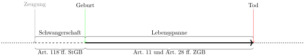

# Die natürlichen Personen

Mit dem Begriff *natürliche Person* sind Menschen gemeint.

Art. 11 Abs. 1 ZGB hält lapidar fest *Rechtsfähig ist jedermann.*

Mit dieser kurzen Formulierung ist sichergestellt, dass alle Menschen
Rechtssubjekte und keine blossen Rechtsobjekte sind. In zeitlicher
Hinsicht wird die Rechtsfähigkeit durch Art. 31 Abs. 1 ZGB präzisiert.
*Die Persönlichkeit beginnt mit dem Leben nach der vollendeten Geburt
und endet mit dem Tode.*

## Beginn der Persönlichkeit

Die Geburt ist im Sinne von Art. 31 Abs. 1 ZGB vollendet, wenn das Kind
den Mutterleib vollständig verlassen hat. Dies deckt sich nicht mit dem
medizinischen Verständnis des Geburtsvorganges, der erst nach dem
Austritt der Plazenta abgeschlossen ist. Dies liegt daran, dass die
vollendete Geburt ein Rechtsbegriff und kein medizinischer Begriff ist.

Art. 31 Abs. 1 ZGB schliesst allerdings nicht aus, dass auch das
ungeborene Leben bereits eine rechtliche Existenz hat. Dies zeigt sich
in Art. 31 Abs. 2 ZGB. Das ungeborene Kind kann unter dem Vorbehalt,
dass es lebendig geboren wird, Rechte und Pflichten erwerben. Ausserdem
wird das ungeborene Kind strafrechtlich durch die Regelung des
Schwangerschaftsabbruchs in Art. 118 ff. StGB geschützt.

## Ende der Persönlichkeit

Die Persönlichkeit endet mit dem Tod. Das ZGB verzichtet dabei auf die
Definition des Todes. Bis zum Inkrafttreten des
Transplantationsgesetztes im Jahr 2004 wurde die Definition des
Todeszeitpunktes der Schweizerischen Akademie der medizinischen
Wissenschaften überlassen. Dies hat es ermöglicht, dem jeweiligen Stand
der medizinischen Möglichkeiten Rechnung zu tragen.  
Das Transplantationsgesetz hat nun jedoch in Art. 9 Abs.
1 Transplantationsgesetz eine Definition des Todeszeitpunktes
aufgestellt. Diese stellt auf den irreversiblen Ausfall des Hirns ab.

## Die Handlungsfähigkeit

Das ZGB definiert die Handlungsfähigkeit natürlicher Personen über
mehrere Stufen. Als erstes wird in Art. 12 ZGB beschrieben, was die
Handlungsfähigkeit ausmacht. Die Handlungsfähigkeit ist die Fähigkeit
durch eigene Handlungen Rechte und Pflichten begründen zu können.
Anschliessend werden in den Art. 13 ff. ZGB die Voraussetzungen der
Handlungsfähigkeit systematisch hergeleitet.  
Art. 13 ZGB zählt die Grundlagen auf: Volljährigkeit und
Urteilsfähigkeit.  
Dabei ist die Volljährigkeit die einfacher zu prüfende Voraussetzung.
Art. 14 ZGB legt fest, volljährig ist, wer das 18. Lebensjahr
zurückgelegt hat.  
Etwas schwieriger ist es mit der Urteilsfähigkeit. Das Gesetz umschreibt
die Urteilsfähigkeit negativ. In Art. 16 ZGB wird festgehalten, wer
nicht urteilsfähig ist. Alle anderen sind im Umkehrschluss urteilsfähig.
Dabei ist nicht Urteilsfähig, wer aufgrund

* seines Kindesalters,
* einer geistigen Behinderung oder psychischen Störung oder
* des Einflusses psychotroper Substanzen

nicht in der Lage ist, vernunftgemäss zu Handeln.

Urteilsfähig ist dementsprechend jemand, der in der Lage ist
vernunftgemäss zu handeln. Dabei darf daran, was vernünftig ist, eine
allzu hohen Anforderungen gestellt werden. Vernünftig ist, was
zumindest halbwegs nachvollziehbar ist. Ob eine konkrete Handlung diese
Anforderungen erfüllt, beurteilt sich im Einzelfall.
Es ist daher möglich, dass jemand in Bezug auf eine Handlung
urteilsfähig ist in Bezug auf eine andere jedoch nicht.
